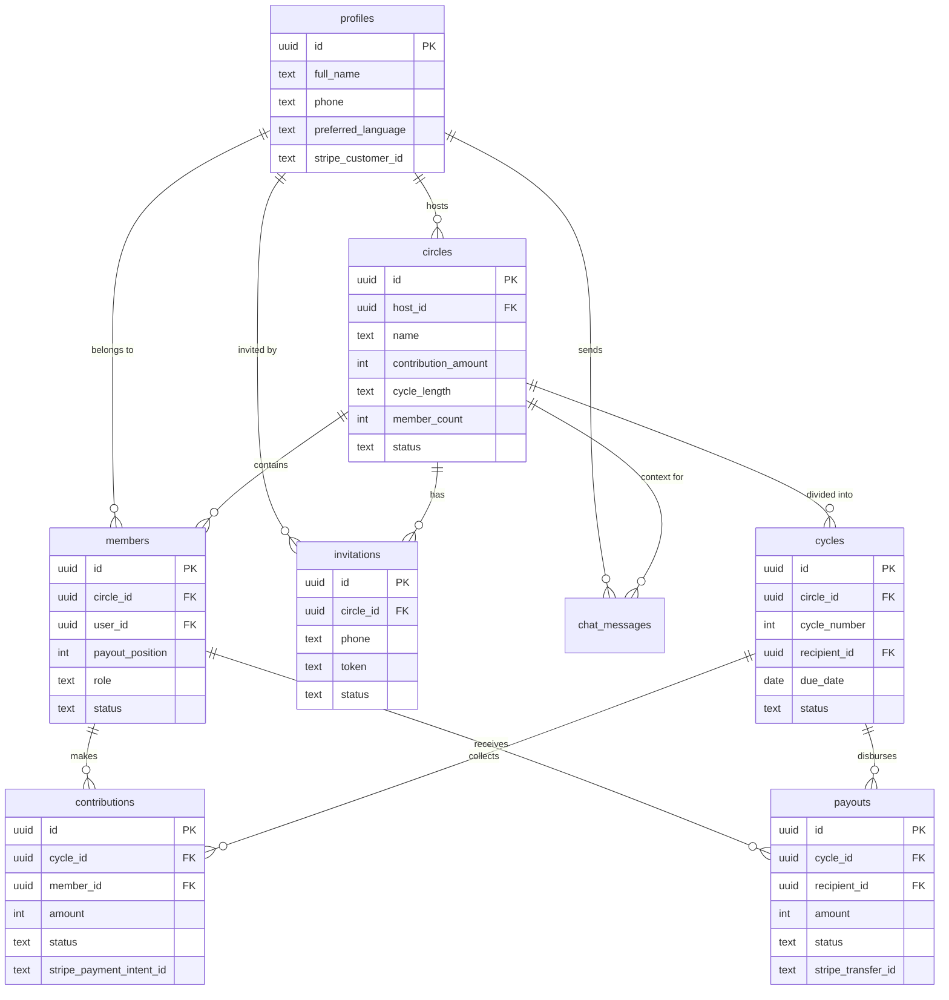

# TrustFund — System Architecture

## 1. User Roles & Permissions

There are two roles, and a host is always also a member of their own circle:

| Role | Can Do |
|------|--------|
| **Host** | Create circle, invite members, assign payout positions, start circle, trigger payouts, close/restart circle |
| **Member** | Join via invite link, make contributions, view ledger, chat with Claude, receive payouts |

A single user can be a host of some circles and a member of others simultaneously.

---

## 2. User Interaction Flows (drives the schema)

I traced every screen and action from the plan to make sure the database supports each one.

### Flow 1: Sign Up / Log In
1. User lands on `/` (landing page)
2. Taps "Get Started" → `/signup`
3. Signs up with **phone number** (primary — Supabase phone auth via Twilio)
4. Enters name, preferred language
5. → Redirected to `/dashboard`

> **Schema need:** `profiles` table extending `auth.users` with name, phone, language, Stripe customer ID.

### Flow 2: Create a Circle
1. Host navigates to `/circles/new`
2. Fills form: circle name, contribution amount ($), cycle length (monthly/biweekly/weekly), member count
3. Sees live preview card: *"6 members × $200/month = $1,200 pot per cycle"*
4. Clicks "Create Circle"
5. → `circles` row created, `members` row created (host, position 1), redirected to `/circles/[id]`

> **Schema need:** `circles` table with amount, cycle config, status. `members` table linking users to circles with a payout position.

### Flow 3: Invite Members
1. Host on `/circles/[id]` opens invite panel
2. Enters 5 phone numbers, optionally assigns each a payout position (2-6)
3. Clicks "Send Invites"
4. → `invitations` rows created, Twilio sends SMS with unique link: `trustfund.app/join/[token]`

> **Schema need:** `invitations` table with phone, token, optional pre-assigned position, status.

### Flow 4: Member Joins via Invite
1. Invitee receives SMS, taps link → `/join/[token]`
2. Sees: circle name, contribution amount, schedule, their assigned position (or picks from open slots)
3. Signs up if needed, agrees to terms, adds Stripe payment method (test mode)
4. Clicks "Accept & Join"
5. → `invitations` row updated to `accepted`, `members` row created

> **Schema need:** invitation → member conversion. Unique constraint on (circle_id, payout_position).

### Flow 5: Circle Starts
1. All positions filled → host sees "Start Circle" button on `/circles/[id]`
2. Host clicks it
3. → Circle status changes to `active`, all `cycles` rows generated (one per member), `contributions` rows created for cycle 1

> **Schema need:** `cycles` table with cycle number, recipient, due date, status. `contributions` table with per-member-per-cycle payment tracking.

### Flow 6: Monthly Contribution
1. Member opens `/circles/[id]` → sees "Your payment of $200 is due April 25"
2. Clicks "Pay Now" → Stripe Checkout (test mode)
3. Stripe confirms → webhook updates contribution to `paid`
4. All members see the ledger update in realtime via Supabase Realtime

> **Schema need:** `contributions` with Stripe payment intent ID, status enum, paid_at timestamp. Realtime subscription on this table.

### Flow 7: Payout
1. All contributions for the current cycle are `paid`
2. Payout auto-triggers (or host manually triggers)
3. → `payouts` row created, Stripe transfer (test mode) to recipient
4. Cycle marked `completed`, next cycle becomes `active`, new contribution rows created

> **Schema need:** `payouts` table with recipient, amount, Stripe transfer ID, status.

### Flow 8: Claude AI — Multilingual Onboarding
1. User opens `/onboarding` and types in their language
2. Claude extracts: member count, contribution amount, cycle length
3. Claude responds in that language confirming the details
4. User confirms → circle is created via API

> **Schema need:** `chat_messages` table for conversation history and context.

### Flow 9: Claude AI — Dispute Resolution
1. Member opens `/circles/[id]/chat`
2. Types "Ya pagué este mes" (or equivalent)
3. API sends message + circle context to Claude
4. Claude tool-calls the DB to look up the member's contribution record
5. Claude responds in the member's language with the payment status

> **Schema need:** Claude needs read access to `contributions` filtered by circle + member. Chat history stored in `chat_messages`.

### Flow 10: SMS Reminders
1. Daily cron job checks for contributions due in 3 days or today
2. Sends SMS via Twilio to members with `pending` contributions
3. Marks reminder as sent to avoid duplicates

> **Schema need:** `reminder_sent_3d` and `reminder_sent_due` booleans on `contributions`.

---

## 3. Database Schema (Supabase / Postgres)

All monetary values stored as **integers in cents** to avoid floating-point issues.

### Table: `profiles`
Extends Supabase `auth.users`. Created via trigger on signup.

| Column | Type | Notes |
|--------|------|-------|
| `id` | `uuid` PK | FK → `auth.users.id` |
| `full_name` | `text` | Display name |
| `phone` | `text` | Phone number |
| `preferred_language` | `text` | Default `'en'`. Options: en, es, zh, bn, ht |
| `stripe_customer_id` | `text` | Nullable, set when Stripe onboarded |
| `created_at` | `timestamptz` | Default `now()` |
| `updated_at` | `timestamptz` | Default `now()` |

### Table: `circles`

| Column | Type | Notes |
|--------|------|-------|
| `id` | `uuid` PK | Default `gen_random_uuid()` |
| `name` | `text` | e.g. "China Lee Coworkers" |
| `host_id` | `uuid` FK → profiles | Circle creator |
| `contribution_amount` | `integer` | In cents. e.g. 20000 = $200 |
| `cycle_length` | `text` | Enum: `'weekly'`, `'biweekly'`, `'monthly'` |
| `member_count` | `integer` | Target size (5-10) |
| `currency` | `text` | Default `'usd'` |
| `status` | `text` | `'forming'` → `'active'` → `'completed'` / `'cancelled'` |
| `start_date` | `date` | Nullable. Set when circle starts |
| `created_at` | `timestamptz` | |
| `updated_at` | `timestamptz` | |

### Table: `members`
Junction table linking users to circles.

| Column | Type | Notes |
|--------|------|-------|
| `id` | `uuid` PK | |
| `circle_id` | `uuid` FK → circles | |
| `user_id` | `uuid` FK → profiles | |
| `payout_position` | `integer` | 1-indexed. Position 1 receives pot in cycle 1 |
| `role` | `text` | `'host'` or `'member'` |
| `status` | `text` | `'active'` / `'removed'` |
| `joined_at` | `timestamptz` | |
| `created_at` | `timestamptz` | |

**Constraints:**
- `UNIQUE(circle_id, user_id)` — can't join same circle twice
- `UNIQUE(circle_id, payout_position)` — no duplicate positions

### Table: `invitations`

| Column | Type | Notes |
|--------|------|-------|
| `id` | `uuid` PK | |
| `circle_id` | `uuid` FK → circles | |
| `phone` | `text` | Invitee phone number |
| `token` | `text` UNIQUE | Random token for invite URL |
| `assigned_position` | `integer` | Nullable. Pre-assigned payout slot |
| `status` | `text` | `'pending'` / `'accepted'` / `'expired'` / `'declined'` |
| `invited_by` | `uuid` FK → profiles | |
| `expires_at` | `timestamptz` | Auto-expire after 7 days |
| `created_at` | `timestamptz` | |

### Table: `cycles`
Pre-generated when host starts the circle. One row per rotation.

| Column | Type | Notes |
|--------|------|-------|
| `id` | `uuid` PK | |
| `circle_id` | `uuid` FK → circles | |
| `cycle_number` | `integer` | 1-indexed |
| `recipient_id` | `uuid` FK → members | Who gets the pot this cycle |
| `due_date` | `date` | When contributions are due |
| `status` | `text` | `'upcoming'` / `'active'` / `'completed'` |
| `created_at` | `timestamptz` | |

**Constraint:** `UNIQUE(circle_id, cycle_number)`

### Table: `contributions`
One row per member per cycle.

| Column | Type | Notes |
|--------|------|-------|
| `id` | `uuid` PK | |
| `cycle_id` | `uuid` FK → cycles | |
| `member_id` | `uuid` FK → members | |
| `amount` | `integer` | In cents |
| `status` | `text` | `'pending'` / `'paid'` / `'overdue'` / `'failed'` |
| `paid_at` | `timestamptz` | Nullable |
| `stripe_payment_intent_id` | `text` | Nullable |
| `reminder_sent_3d` | `boolean` | Default `false`. 3-day reminder sent? |
| `reminder_sent_due` | `boolean` | Default `false`. Due-day reminder sent? |
| `created_at` | `timestamptz` | |

**Constraint:** `UNIQUE(cycle_id, member_id)` — prevents double payment records

### Table: `payouts`
One row per cycle payout.

| Column | Type | Notes |
|--------|------|-------|
| `id` | `uuid` PK | |
| `cycle_id` | `uuid` FK → cycles | |
| `recipient_id` | `uuid` FK → members | |
| `amount` | `integer` | Total pot in cents |
| `status` | `text` | `'pending'` / `'processing'` / `'completed'` / `'failed'` |
| `paid_at` | `timestamptz` | Nullable |
| `stripe_transfer_id` | `text` | Nullable |
| `created_at` | `timestamptz` | |

### Table: `chat_messages`
Stores Claude AI conversation history for both onboarding and disputes.

| Column | Type | Notes |
|--------|------|-------|
| `id` | `uuid` PK | |
| `user_id` | `uuid` FK → profiles | |
| `circle_id` | `uuid` FK → circles | Nullable. Set for dispute chats, null for onboarding |
| `session_id` | `uuid` | Groups messages in one conversation |
| `role` | `text` | `'user'` / `'assistant'` |
| `content` | `text` | Message body |
| `created_at` | `timestamptz` | |

### Entity Relationship Diagram



---

## 4. Row Level Security (RLS) Policies

Every table has RLS enabled. Key policies:

| Table | Policy | Rule |
|-------|--------|------|
| `profiles` | Users read/update own profile | `auth.uid() = id` |
| `circles` | Members can read their circles | User's ID exists in `members` for that circle |
| `circles` | Only host can update | `auth.uid() = host_id` |
| `members` | Members can read co-members | User is a member of the same circle |
| `invitations` | Host can CRUD | `auth.uid() = invited_by` |
| `contributions` | Members can read circle contributions | User is a member of the same circle |
| `contributions` | Members can update own (pay) | `member.user_id = auth.uid()` |
| `payouts` | Members can read circle payouts | User is a member of the same circle |
| `chat_messages` | Users read/write own messages | `auth.uid() = user_id` |

---

## 5. Supabase Realtime Subscriptions

These power the live-updating shared ledger:

| Page | Subscribe To | Filter | Purpose |
|------|-------------|--------|---------|
| `/circles/[id]` | `contributions` | `cycle_id = current_cycle.id` | Live "who paid" indicators |
| `/circles/[id]` | `payouts` | `cycle_id = current_cycle.id` | Payout confirmation |
| `/circles/[id]` | `members` | `circle_id = id` | New member joined |

---

## 6. API Routes (Next.js App Router)

### Circles
| Method | Route | Description |
|--------|-------|-------------|
| `POST` | `/api/circles` | Create circle + host member row |
| `GET` | `/api/circles/[id]` | Circle details + members + current cycle |
| `POST` | `/api/circles/[id]/invite` | Create invitations, send SMS via Twilio |
| `POST` | `/api/circles/[id]/start` | Set status=active, generate cycles + first batch of contributions |

### Join
| Method | Route | Description |
|--------|-------|-------------|
| `GET` | `/api/join/[token]` | Validate token, return circle preview |
| `POST` | `/api/join/[token]` | Accept invite, create member row |

### Payments
| Method | Route | Description |
|--------|-------|-------------|
| `POST` | `/api/contributions/[id]/pay` | Create Stripe PaymentIntent, return client secret |
| `POST` | `/api/payouts/[id]/disburse` | Check all paid, create Stripe transfer |

### AI
| Method | Route | Description |
|--------|-------|-------------|
| `POST` | `/api/chat` | Send message to Claude (with circle context for disputes) |

### Webhooks & Cron
| Method | Route | Description |
|--------|-------|-------------|
| `POST` | `/api/webhooks/stripe` | Handle `payment_intent.succeeded` → update contribution |
| `GET` | `/api/cron/reminders` | Vercel Cron — find due contributions, send Twilio SMS |

---

## 7. Next.js File Structure

```
hunter-hack/
├── src/
│   ├── app/
│   │   ├── (auth)/                        ← Auth layout (no nav)
│   │   │   ├── login/page.tsx
│   │   │   ├── signup/page.tsx
│   │   │   └── layout.tsx
│   │   ├── (app)/                         ← Authenticated layout (with nav)
│   │   │   ├── dashboard/page.tsx         ← List of user's circles
│   │   │   ├── circles/
│   │   │   │   ├── new/page.tsx           ← Create circle form
│   │   │   │   └── [id]/
│   │   │   │       ├── page.tsx           ← Circle dashboard + ledger
│   │   │   │       ├── invite/page.tsx    ← Manage invitations
│   │   │   │       └── chat/page.tsx      ← Claude dispute chat
│   │   │   ├── onboarding/page.tsx        ← Claude multilingual circle setup
│   │   │   └── layout.tsx
│   │   ├── join/[token]/page.tsx          ← Public invite acceptance page
│   │   ├── api/                           ← (routes listed in Section 6)
│   │   ├── layout.tsx                     ← Root layout (fonts, metadata)
│   │   └── page.tsx                       ← Landing page
│   ├── components/
│   │   ├── ui/                            ← Button, Input, Card, Badge
│   │   ├── circles/                       ← CircleCard, CreateCircleForm
│   │   ├── ledger/                        ← LedgerTable, ContributionRow
│   │   └── chat/                          ← ChatWindow, ChatBubble
│   ├── lib/
│   │   ├── supabase/
│   │   │   ├── client.ts                  ← Browser Supabase client
│   │   │   ├── server.ts                  ← Server-side Supabase client
│   │   │   └── middleware.ts              ← Auth middleware
│   │   ├── stripe.ts
│   │   ├── twilio.ts
│   │   ├── claude.ts                      ← Anthropic client + system prompts
│   │   └── utils.ts                       ← Format currency, dates
│   ├── types/
│   │   └── database.ts                    ← TypeScript types from Supabase
│   └── hooks/
│       ├── use-realtime.ts                ← Generic Supabase realtime hook
│       └── use-circle.ts                  ← Fetch circle + subscribe
├── supabase/
│   ├── migrations/
│   │   └── 001_initial_schema.sql         ← All tables, RLS, triggers
│   └── seed.sql                           ← "China Lee Coworkers" demo data
├── public/
│   ├── manifest.json                      ← PWA manifest
│   └── icons/
├── .env.local.example
├── next.config.js
├── tailwind.config.ts
├── tsconfig.json
├── package.json
├── plan.md
└── architecture.md
```

---

## 8. Claude AI Integration Design

### Onboarding Agent (circle creation via natural language)

```
System prompt:
  You are a TrustFund assistant helping immigrants create savings circles.
  Detect the user's language and respond in it. Extract:
  - member_count, contribution_amount, cycle_length
  Confirm details, then return structured JSON to create the circle.

Tools available to Claude:
  - create_circle({ name, amount, cycle_length, member_count })
```

### Dispute Mediator (queries real data)

```
System prompt:
  You are a TrustFund assistant resolving payment disputes.
  You have access to the circle's contribution records.
  Always respond in the user's language. Be factual — cite dates and amounts.

Tools available to Claude:
  - lookup_contribution({ circle_id, member_name_or_phone, cycle_number })
  - lookup_member_history({ circle_id, member_name_or_phone })
```

Both agents use **Claude Sonnet 4.5** via the Anthropic SDK with tool use.

---

## 9. Key Edge Cases & How the Schema Handles Them

| Edge Case | Solution |
|-----------|----------|
| **Double payment** | `UNIQUE(cycle_id, member_id)` on contributions. API checks status before creating PaymentIntent. |
| **Member leaves mid-cycle** | Set `members.status = 'removed'`. Their remaining contributions become N/A. Host decides how to fill the gap (out of hackathon scope). |
| **Late payment** | Cron job updates `contributions.status` to `'overdue'` when past `cycles.due_date`. |
| **Invite expires** | `invitations.expires_at` checked on join attempt. Cron can bulk-expire old invitations. |
| **Host is also a member** | Host gets a `members` row with `role = 'host'`. They contribute and can receive payouts like everyone else. |

---

## 10. Open Questions for the Team

These decisions affect the schema and UX. Please weigh in before we start building.

1. **Auth method — phone-first or email-first?**
   Phone auth (OTP via SMS) is more natural for the immigrant user base, but it means Twilio handles both auth SMS and reminder SMS. Email is simpler to set up. **Recommendation:** Phone-first with email as fallback.

2. **Payout position selection — host assigns all, or members pick?**
   The plan says "host assigns or members pick slots." For hackathon simplicity, I'd recommend **host assigns all positions when inviting** (the invitation includes the assigned slot). If you want members to pick, the join page needs a slot picker, which is more work.

3. **Auto-payout or manual trigger?**
   Should the payout fire automatically when all contributions are collected, or should the host click a button? **Recommendation:** Auto-trigger with a confirmation notification to the host. Simpler for demo.

4. **UI language vs Claude language?**
   Should the entire app UI be translated (full i18n), or just keep the UI in English and let Claude handle multilingual conversations? **Recommendation for hackathon:** English UI + Claude responds in the user's language. Full i18n is a lot of work for 24 hours.

5. **How many team members, and how do you want to split the work?**
   This affects whether we parallelize frontend/backend or go sequential. Knowing the team size helps me suggest a task breakdown.
